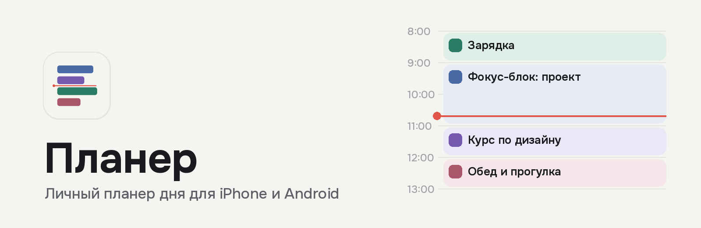

<p align="center">
  
</p>

<p align="center">
  <a href="https://github.com/antaledenis-alt/dailytracker-gg/actions/workflows/build.yml"></a>
  <a href="https://github.com/antaledenis-alt/dailytracker-gg/releases/latest"></a>
  
  <a href="LICENSE"></a>
</p>

# Планер

Планер дня для личного использования. Расписание показано на временной шкале, задачи разделены по категориям цветом, иконкой и фактурой. Приложение напоминает о задачах и ведёт статистику выполнения. Все данные хранятся только на устройстве: аккаунты и сервер не нужны.

## Содержание

- [Возможности](#возможности)
- [Установка](#установка)
- [Использование без ограничения в 7 дней](#использование-без-ограничения-в-7-дней)
- [Сборка](#сборка)
- [Структура проекта](#структура-проекта)
- [Планы](#планы)
- [Лицензия](#лицензия)

## Возможности

### Расписание

- Временная шкала с 6:00 до 24:00 с сеткой по 30 и 60 минут и линией текущего времени.
- Пять категорий: работа, учёба, хобби, спорт, отдых. У каждой свой цвет, иконка и фактура блока, поэтому их легко различить даже без цвета.
- Горизонт планирования — текущая и следующая неделя.
- Повторяющиеся задачи по дням недели.
- Шаблоны дня «Рабочий день» и «Выходной».

### Управление задачами

| Действие | Жест |
|---|---|
| Создать задачу на конкретное время | Нажатие на пустое место шкалы |
| Открыть задачу | Нажатие на блок |
| Перенести задачу | Долгое нажатие и перетаскивание (шаг 30 минут) |
| Отметить выполнение | Нажатие на круг справа от блока |
| Перейти к соседнему дню | Горизонтальный свайп |

### Статусы

| Статус | Как присваивается | Баллы |
|---|---|---|
| Запланировано | При создании | — |
| Выполнено вовремя | Отметка пользователем | 1 |
| Выполнено позже | Отметка пользователем | 0,5 |
| Пропущено | Автоматически, если задача закончилась без отметки | 0 |

Пропущенную задачу можно исправить на «вовремя» или «позже», статистика пересчитается.

### Напоминания

- За 30, 15 или 5 минут до начала и в момент начала, в любом сочетании.
- Настойчивые повторы: от 2 до 5 раз с интервалом 3–15 минут, пока задача не отмечена.
- Уведомление в конце задачи с вопросом о результате.
- Кнопки прямо в уведомлении: «Готово», «+10 минут», «Перенести».
- На iOS — напоминание о продлении бесплатной подписи за 24 часа, 3 часа и 30 минут до её окончания.

### Статистика

- Продуктивность от 0 до 100 и процент выполнения за неделю или за 14 дней.
- Разбивка по дням и по категориям, сравнение с предыдущим периодом.
- Подсказка о задачах, которые пропускаются чаще всего.

## Установка

Готовые файлы публикуются в разделе [Releases](https://github.com/antaledenis-alt/dailytracker-gg/releases/latest).

| Платформа | Файл | Инструкция |
|---|---|---|
| iPhone (iOS 16.4 и новее) | `Planner.ipa` | [docs/install-ios.md](docs/install-ios.md) |
| Android (7.0 и новее) | `Planner.apk` | [docs/install-android.md](docs/install-android.md) |

## Использование без ограничения в 7 дней

На iPhone приложение, подписанное бесплатным Apple ID, работает 7 дней, после чего подпись нужно продлить. На Android такого ограничения нет. Способы обойти ограничение на iOS и сравнение по стоимости и надёжности: [docs/no-7-day-limit.md](docs/no-7-day-limit.md).

## Сборка

Сборка выполняется в GitHub Actions ([.github/workflows/build.yml](.github/workflows/build.yml)) при каждом push в ветку `main` или вручную: Actions → Build → Run workflow.

| Задача | Окружение | Результат |
|---|---|---|
| Проверка типов | ubuntu-latest | `tsc --noEmit` |
| iOS | macos-26, Xcode 26 | `Planner.ipa` без подписи |
| Android | ubuntu-latest, JDK 17 | `Planner.apk` |
| Публикация | ubuntu-latest | Релиз `v<версия>-build.<номер>` |

Локальная разработка описана в [docs/development.md](docs/development.md).

## Структура проекта

```
App.tsx                     корневой компонент, уведомления, фоновые проверки
app.json                    конфигурация Expo
locales/ru.json             русское название приложения
plugins/withNoPush.js       удаление push-разрешения (несовместимо с бесплатной подписью)
src/
  theme.ts                  цвета, категории, шрифты, параметры анимаций
  lib/
    db.ts                   локальная база SQLite
    store.ts                состояние приложения и действия с задачами
    notifications.ts        планирование локальных уведомлений
    signing.ts              срок действия подписи iOS
    stats.ts                расчёт статистики
    date.ts                 работа с датами
  components/               элементы интерфейса
  screens/                  экраны и шторки
docs/                       документация
```

## Планы

- Виджеты на экране блокировки и рабочем столе.
- Изменение длительности задачи перетаскиванием нижнего края блока.
- Быстрый ввод задачи одной строкой.
- Экспорт и импорт данных.

История изменений — [CHANGELOG.md](CHANGELOG.md).

## Лицензия

Распространяется по лицензии MIT, текст — в файле [LICENSE](LICENSE).
